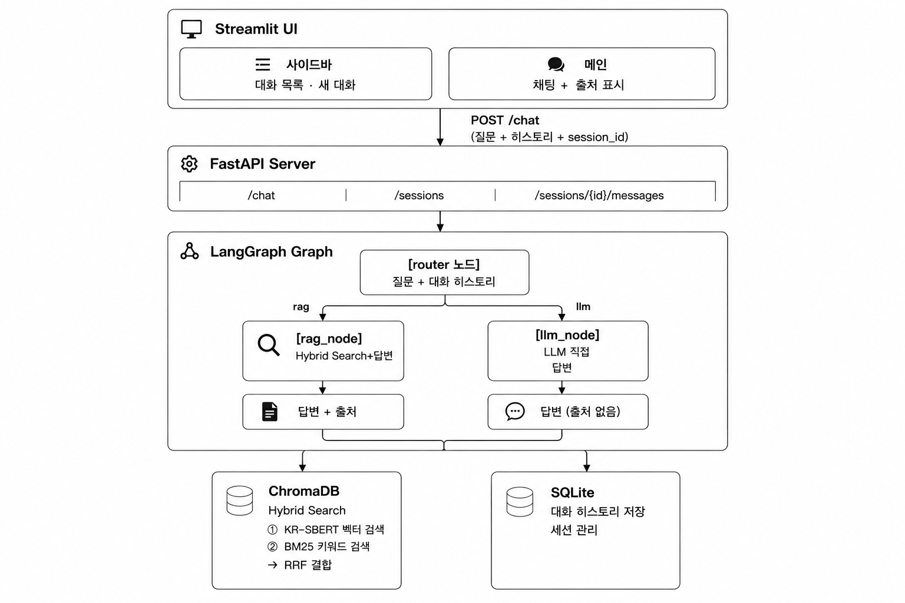
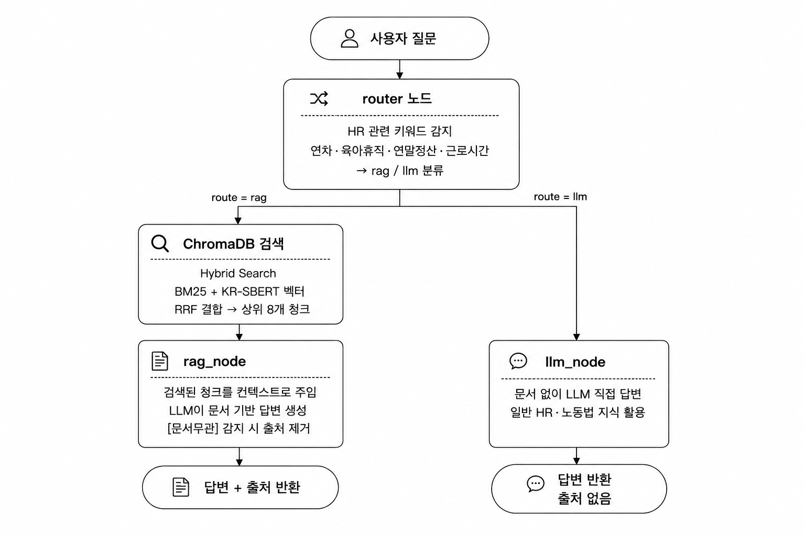
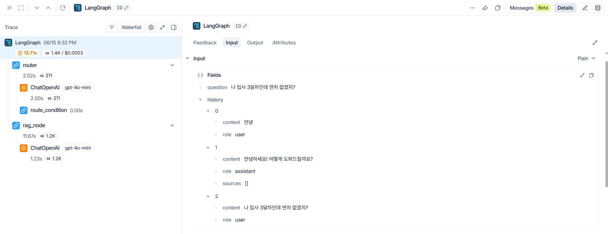
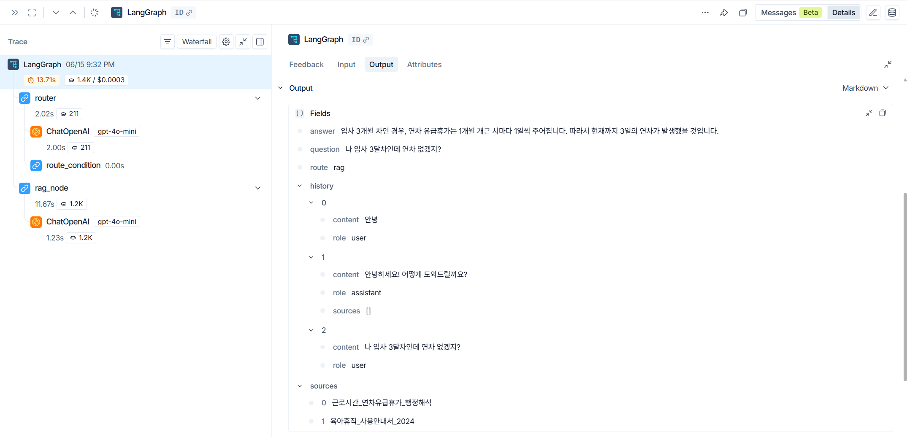

# HR Assistant
### 기업 인사·행정 규정 문서 기반 AI 질의응답 시스템

---

## 1. 프로젝트 기간

2026.06.01 ~ 2026.06.30

---

## 2. 프로젝트 개요

### 2.1. 프로젝트 배경 및 목적

이전 직장에서 경영 지원 업무를 담당하며 직원들의 출장 경비 처리를 맡았습니다.
처리 기준이 케이스마다 달라서, 매번 사내 규정 문서를 직접 뒤져서 확인해야 했습니다.

> "이 경비는 처리가 되는 건가? 한도가 얼마지? 증빙은 뭐가 필요하지?"

문서는 있었지만, 수십 페이지 중 원하는 내용을 찾는 데만 시간이 걸렸습니다.
**"그냥 물어보면 바로 답해주면 얼마나 좋을까"** — 이 경험이 이 프로젝트의 출발점입니다.

현재는 재직 중이 아니어서 실제 사내 문서를 구하기 어렵습니다.
대신 공개된 노동 관련 규정 문서(연차휴가, 육아휴직, 연말정산, 근로시간)를 활용해 동일한 구조로 구현했습니다.

---

### 2.2. 프로젝트 목표

사내 규정 PDF를 학습시켜, 직원이 자연어로 질문하면 관련 내용을 검색해 **출처와 함께** 답변하는 AI 어시스턴트 구축

---

### 2.3. 기대 효과

| 관점 | 효과 |
|---|---|
| 직원 | 수십 페이지 문서를 직접 뒤지지 않아도 됨 → **규정 확인 시간 단축** |
| HR 담당자 | "연차가 며칠이에요?" 같은 반복 문의 응대 횟수 감소 → **핵심 업무 집중 가능** |
| 기업 | 동일한 인력으로 더 많은 업무 처리 가능 → **업무 효율 향상** |

---

## 3. 기술 스택

| 분류 | 기술 스택 배지 |
|---|---|
| AI & LLM |     |
| Backend & API |    |
| Database & Infra |   |
| Frontend & Tools |    |

---

## 4. 시스템 아키텍처

### 아키텍처 다이어그램



### ERD

**SQLite** (`data/chat_history.db`) — 대화 히스토리 저장용

```
sessions
├── id          TEXT  PK (UUID)
├── title       TEXT           ← 첫 질문 30자
└── created_at  DATETIME

chat_history
├── id          INTEGER  PK
├── session_id  TEXT     FK → sessions.id
├── question    TEXT
├── answer      TEXT
├── sources     TEXT     (콤마 구분, llm이면 빈 값)
├── route       TEXT     (rag / llm)
└── created_at  DATETIME
```

**ChromaDB** (`data/vector_store/`) — 문서 임베딩 저장용

```
hr_docs (컬렉션)
├── id          TEXT     ← 청크 고유 ID (예: 연차휴가청구권_0)
├── document    TEXT     ← 청크 원문 텍스트 (500자 단위)
├── embedding   VECTOR   ← KR-SBERT 768차원 벡터
└── metadata    JSON     ← {"source": "문서명.txt"}
```

> SQLite는 SQLAlchemy ORM으로 직접 설계·관리하고, ChromaDB는 라이브러리가 내부적으로 관리합니다. 두 DB가 역할이 달라 분리 운영합니다.

---

## 5. 시스템 구현

### 5.1. 문서 데이터

| 항목 | 내용 |
|---|---|
| 문서 종류 | 연차휴가, 육아휴직, 연말정산, 근로시간·휴게시간·휴일 |
| 형식 | PDF (총 11개 파일) |
| 청크 수 | 1,460개 |
| 청크 크기 | 500자, 오버랩 50자 |
| 임베딩 모델 | KR-SBERT — 한국어에 특화된 문장 유사도 AI 모델 |

---

### 5.2. RAG 파이프라인

```
[PDF 문서]
    │
    ▼
[PyMuPDF 텍스트 추출]  ←── 일부 PDF에서 한글이 깨지면 이미지로 변환 후 문자 인식(OCR)으로 재추출
    │
    ▼
[RecursiveCharacterTextSplitter]  chunk_size=500, overlap=50
    │  500자 단위로 자르되 문장이 잘리지 않도록 재귀적으로 분할
    ▼
[KR-SBERT 임베딩]  텍스트 → 768차원 숫자 벡터로 변환
    │
    ▼
[ChromaDB]  벡터 저장 + 유사도 검색 (Hybrid Search: BM25 + 벡터 RRF 결합)
```

**Hybrid Search 도입 이유**

초기에는 KR-SBERT 벡터 검색만 사용했으나, 숫자·키워드가 핵심인 질문에서 한계가 있었습니다.

> 예) "연장근로 수당은 **50%** 붙나요?" → 벡터 검색은 의미 유사 청크를 찾지만, "50%"라는 정확한 수치가 있는 청크를 놓치는 경우 발생

| 검색 방식 | 강점 | 약점 |
|---|---|---|
| 벡터 검색 (KR-SBERT) | 의미적으로 유사한 문장 검색 | 정확한 수치·키워드 매칭에 약함 |
| BM25 (키워드) | "15일", "80%", "30일 전" 같은 정확한 단어 매칭에 강함 | 문맥·동의어 이해 불가 |
| **Hybrid (RRF 결합)** | **두 방식의 장점을 모두 활용** | — |

RRF(Reciprocal Rank Fusion)는 두 검색 결과의 순위를 점수로 변환해 합산하는 방식으로, 별도의 점수 정규화 없이 두 검색을 결합할 수 있어 선택했습니다.

---

### 5.3. LangGraph 라우팅 구조



**노드 간 공유 데이터 (GraphState)**

```python
class GraphState(TypedDict):
    question : str        # 사용자 질문
    history  : list[dict] # 이전 대화 내역
    route    : str        # "rag" or "llm"
    answer   : str        # 최종 답변
    sources  : list[str]  # 출처 파일명 목록
```

---

### 5.4. 실행 모니터링 (LangSmith)

LangSmith를 연동해 LangGraph 실행 흐름을 실시간으로 추적합니다.

**확인 가능한 정보**
- 질문이 `router → rag_node` 또는 `router → llm_node` 중 어디로 갔는지
- 각 노드의 입력/출력 내용 및 대화 히스토리 전달 여부
- 노드별 처리 시간 및 질문당 API 비용


**Input** (질문 + 히스토리 전달)



**Output** (답변 + 경로 + 출처)



---

## 6. 주요 기능

- **문서 기반 Q&A**: 사내 규정 PDF에서 관련 내용 검색 후 출처 포함 답변
- **일반 Q&A**: 문서와 무관한 질문은 LLM이 직접 답변
- **자동 경로 분기**: 질문 유형에 따라 두 경로 자동 선택
- **연속 대화**: 이전 맥락을 기억하며 대화 가능
- **대화 기록 저장**: 모든 질문/답변/경로를 SQLite DB에 저장
- **멀티 대화 관리**: 사이드바에서 대화방 생성·전환·삭제 (삭제 시 DB에서도 제거)

### 디렉토리 구조

```
project01/
├── backend/
│   └── app/
│       ├── rag/
│       │   ├── parser.py           # PDF 텍스트 추출 (PyMuPDF + EasyOCR)
│       │   ├── chunker.py          # 청크 분할
│       │   ├── embedder.py         # 임베딩 + ChromaDB 저장
│       │   └── retriever.py        # Hybrid Search (BM25 + 벡터 RRF)
│       ├── graph/
│       │   └── graph.py            # LangGraph 라우팅 그래프
│       ├── api/routes/
│       │   └── chat.py             # /chat, /sessions 엔드포인트 (HTTP 레이어)
│       ├── services/
│       │   └── chat_service.py     # 비즈니스 로직 (LangGraph 호출, DB 저장)
│       ├── database.py             # SQLite 모델 + 연결
│       ├── logger.py               # 로깅 설정
│       └── main.py                 # FastAPI 앱
├── frontend/
│   └── app.py                      # Streamlit UI
├── data/
│   ├── raw/                        # 원본 PDF (git 제외)
│   ├── extracted/                  # 추출된 텍스트
│   ├── chunks/                     # 청크 JSON
│   └── vector_store/               # ChromaDB (git 제외)
├── logs/                           # 실행 로그 (git 제외)
├── requirements.txt
└── dev_log.md                      # 개발 학습 일지
```

---

## 7. 시연 영상

<video src="docs/image/시연 영상.mp4" controls width="100%"></video>

---

## 8. 테스트 결과

### E2E 테스트

| 질문 | 예상 경로 | 실제 경로 | 결과 |
|---|---|---|---|
| 1년 미만 근로자도 연차휴가를 받을 수 있나요? | rag | rag | 문서 기반 답변 + 출처 ✅ |
| 육아휴직 기간은 얼마나 되나요? | rag | rag | 문서 기반 답변 + 출처 ✅ |
| 연차 쓸 때 팀장한테 몇 일 전에 얘기해야 해? | llm | llm | 일반 지식 답변, 출처 없음 ✅ |
| 퇴직금은 얼마예요? | llm | llm | 일반 지식 답변 ✅ |
| 오늘 날씨 어때요? | llm | llm | 실시간 정보 없다고 안내 ✅ |

---

### RAG 품질 평가 (RAGAS)

Q&A 데이터셋 기준 (연차휴가·육아휴직·연말정산·근로시간·일반 HR 혼합)

| 지표 | 1차 (기본) | 2차 (프롬프트 강화) | 3차 (Hybrid Search) | 해석 |
|---|---|---|---|---|
| Faithfulness | 0.24 | 0.34 | **0.65** | 환각 억제 지속 개선 ✅ |
| Context Recall | 0.47 | 0.45 | **0.58** | Hybrid Search로 포괄 범위 확대 ✅ |
| Context Precision | 0.96 | 0.97 | 0.55 | 일반 HR 질문 추가로 희석 |
| Answer Relevancy | 측정 불가 | 측정 불가 | 측정 불가 | 아래 참고 |

> **핵심**: Faithfulness 0.24 → 0.65로 170% 향상. 프롬프트 강화 + Hybrid Search(BM25+벡터 RRF)의 복합 효과.

**Answer Relevancy 측정 불가 사유**

Answer Relevancy는 "이 답변은 어떤 질문에 대한 답인가?"를 LLM이 역질문 3개로 생성하고, 원래 질문과 임베딩 유사도를 비교하는 방식으로 동작합니다.

측정 실패 원인은 두 가지입니다.
1. **모델 호환 문제**: RAGAS가 내부적으로 사용하는 역질문 생성 프롬프트가 `gpt-3.5-turbo` / `gpt-4` 기준으로 설계되어, `gpt-4o-mini`에서는 3개 대신 1개만 반환되어 계산이 NaN 처리됨
2. **라이브러리 버전 불일치**: 사용 중인 RAGAS 버전에서 임베딩 API 인터페이스가 변경되어 내부 호환 오류 발생

**대안 검토 및 결론**

| 대안 | 검토 결과 |
|---|---|
| `gpt-4o`로 교체 | 역질문 생성 품질은 개선되나 평가 1회당 비용이 약 10배 증가 |
| `gpt-3.5-turbo`로 교체 | RAGAS 원설계 모델이라 호환 가능성 높으나, 프로젝트 전체가 `gpt-4o-mini` 기반이라 평가 환경 불일치 발생 |
| RAGAS 구버전(0.1.x) 다운그레이드 | 다른 3개 지표 측정 방식까지 변경되어 기존 결과와 비교 불가 |

핵심 지표인 **Faithfulness**(환각 억제)와 **Context Precision/Recall**(검색 품질)로 RAG 성능을 충분히 평가할 수 있다고 판단하여 Answer Relevancy는 제외했습니다.

---

## 9. 설치 및 실행

### 환경 설정

```bash
python -m venv venv
venv\Scripts\activate
pip install -r requirements.txt
```

### 환경 변수 설정

`backend/.env` 파일 생성:

```
OPENAI_API_KEY=your_api_key
OPENAI_MODEL=gpt-4o-mini
```

### RAG 파이프라인 실행 (최초 1회)

```bash
python -m backend.app.rag.parser     # PDF 텍스트 추출
python -m backend.app.rag.chunker    # 청크 분할
python -m backend.app.rag.embedder   # 임베딩 + ChromaDB 저장
```

### 서버 실행

```bash
# FastAPI 서버 (터미널 1)
uvicorn backend.app.main:app --reload

# Streamlit UI (터미널 2)
streamlit run frontend/app.py
```

---

## 10. 트러블슈팅

### 1. RAG 프롬프트 모순으로 인한 일반 지식 답변 누락
- **현상**: 문서에 없는 HR 질문(예: "근로계약서를 반드시 써야 하나요?")에  "문서에 없는 내용은 답변할 수 없습니다"만 반환
- **원인**: 
    - 프롬프트 내 `"[문서무관] 후 일반 지식으로 답변하세요"`와 `"절대 추가하지 마세요"` 지시가 충돌.
    - LLM이 더 강한 어조의 금지 지시를 우선 적용
- **해결**: 프롬프트를 명확한 if-else 구조로 재작성 + 출력 예시 추가
```
- [참고 문서]에 답이 있으면: 문서 내용을 바탕으로 정확하게 답변하세요.
- [참고 문서]에 답이 없으면: 첫 줄에 반드시 "[문서무관]"을 출력한 뒤 일반 지식으로 답변하세요.
```
- **결과**: 문서 외 HR 질문에 일반 지식 답변 정상 반환, 출처 미표시 처리

### 2. RAGAS Answer Relevancy 측정 불가
- **현상**: RAGAS 평가 실행 후 `answer_relevancy`만 NaN으로 출력됨
- **원인**: Answer Relevancy는 LLM에게 "이 답변은 어떤 질문에 대한 답인가?"를 역질문 3개로 생성하게 한 뒤, 원래 질문과 유사도를 비교하는 방식으로 동작함. 그런데 이 역질문 생성 프롬프트가 `gpt-3.5-turbo` / `gpt-4` 기준으로 설계되어 있어, 프로젝트에서 사용 중인 `gpt-4o-mini`에서는 3개 대신 1개만 반환됨 → 유사도 계산 불가 → NaN
- **대안 검토**:
    - `gpt-4o`로 교체 → 평가 비용 약 10배 증가로 기각
    - `gpt-3.5-turbo`로 교체 → 프로젝트 전체가 `gpt-4o-mini` 기반이라 평가 환경 불일치
- **결론**: Answer Relevancy를 제외한 나머지 3개 지표(Faithfulness, Context Precision, Context Recall)로 RAG 품질 판단

---

## 11. 결론 및 향후 개선 방향

본 프로젝트는 사내 규정 문서를 PDF 형태로 보유하고 있지만 활용이 어려운 기업 환경에서, 직원이 자연어로 질문하면 관련 규정을 즉시 찾아 출처와 함께 답변하는 AI 어시스턴트를 구현했습니다.

**향후 개선 방향**
- 실제 기업 사내 문서(출장 경비, 복지 규정 등)로 확장
- 질문 유형(사실 질문 vs 개요 요청) 추가 분류로 개요 답변 품질 개선
- 답변 스트리밍 적용으로 체감 응답 속도 개선
- 사용자 인증(로그인) 도입 → 사용자별 session 분리 관리 (현재는 단일 사용자 기준)
- 사용자 피드백(좋아요/싫어요) 수집 → 답변 품질 개선 데이터로 활용
